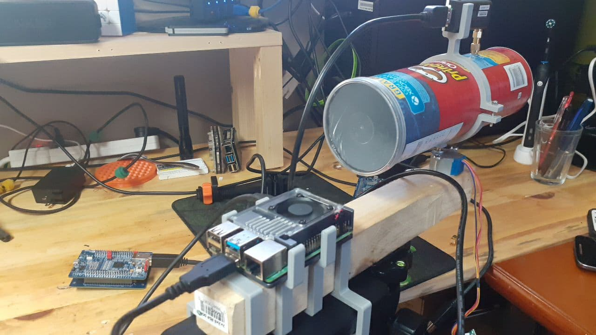
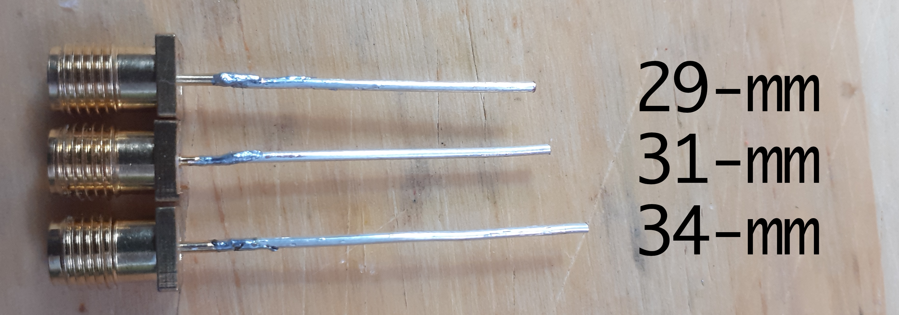
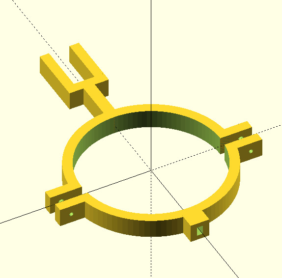

# WiFi-Talk

Basics in radio and directional finding using RPi, antennas and arduinos.

## Disclaimer

**This information is for educational and informational purposes only. 
You have the final decision on modifing your hardware, software, and use of it.
And yours is the responsability of any consequences of the improper use of it.**

**This is only a prototype, intensionally limited in speed and efficiency to
aid in learning radio, any modifications for commercial or malicious intentions
implies you know what you are doing, the risks and consequences.**

# Summary
Everything started with a comment during a twitch live on
[zerialkiller](https://www.twitch.tv/zerialkillerhacking) channel, someone
suggested of ways to find WiFi devices and here I am a couple of months later.

The first part is how to keep your hardware safe, electronics after reaching
their limits, there is no `UNDO` button. And as described in the disclaimer,
this is a slow (but working) prototype with the sole objective of learning,
to serve as a minimal base to start. Check the video, I'm sure you will
find many ideas on how to continue.

# The parts

This play have four acts:
1. RF hardware connections and not frying electronics.
2. Simple arduino firmware that moves the antenna.
3. Slow and inefficient scripts capturing and plotting data.
4. Creating plots.

## RF hardware

### Pringles can

This is a bad option, the diameter is off by several millimeters. In the other
and, it is easy to get one, easy to drill and install the monopole. Make a 6mm
hole from the back of the can to install the dipole later.

### 1/4 wave monopole

**SMA and RP-SMA connector**
There are two types of SMA connectors, SMA and RP-SMA, the RP for
reverse-polarity, RF-SMA was designed to comply with FCC regulations and
avoid what we are going to do, connect Wi-Fi equipment to radio equipment not
designed for that. Check the connector and buy the adapter you need.

The total length is ~31-mm including any extra length from the connector
itself. The first time I made one of these antennas I used calipers and
sand paper to be sure the length was right down to 0.1-mm now that I have
the equipment to see how close it needs to be, you can save time,
+/-1-mm is close enough, in fact I tried 29-mm to 34-mm there are differences
on performance and they will work too.

### Unnecessary 3D printed parts

I make a clamp to hold the cantenna, hold the USB dongle on top and plug into
the stepper motor axis directly. I'm using a *28BYJ-48* motor, in case you use
the same check the [OpenSCAD](wifi-DF-mount.scad) just change
`axis_d` and `axis_t` to make the square hole match the axis of your motor.

You need this? No. Duct-tape and hot-glue are much faster and simple. My inner
child wants to persuade my adult me that it wasn't an impulse buy.

**NOTE:** Please check the video with zerialkiller there are more details there
that I can add here. Hardware can make or break the project, modifying 90-cm
parabolic antennas to use bi-quad feeds will increase coverage area and detect
devices with lower power output. The issue is you loose accuracy, instead of
0.5-m indoors you will get several meters on proportionally larger area.

## Arduino firmware 

[Sketch](arduino-stepper-sketch/arduino-stepper-sketch.ino)

Here things start to get inefficient (even more). The arduino expect commands
on serial port, three, no four, no five. Three 😁
1. **R** to reset the counter this defines the current heading of the antenna to
zero.
2. **cNNNN** get the current position of the antenna it is the step counter.
NNNN is a four digits number.
3. **gNNNN** go-to `NNNN` position, it needs to be a 4-digit number, leading
empty spaces for 999 and lower must be zeros.

Why this is slow? After a go-to the arduino doesn't reply to any messages. If
you thought on requesting a full circle, capture data and get the position
during the rotation to increase readout speed, you are in the right path. Fix
this issue and you can reduce time.

## Slow and inefficient scripts.
